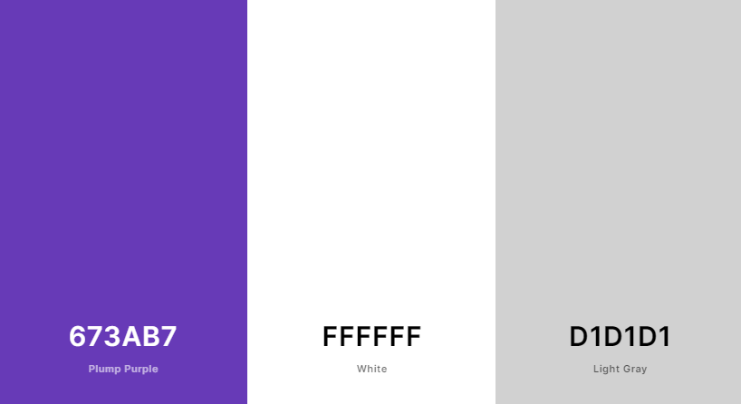

# Books' World

The aim of this project is to provide a place where the user can write down a personal summary of a book and the main insights they got from the book.
Also, the user will be able to create a list of books they want and share with other users if desired.

#ADD Live demo on Heroku pages

## Table of Contents:

- [UX](#ux)
  - [User Stories](#user-stories)
  - [Strategy](#1-strategy)
  - [Scope](#2-scope)
  - [Structure](#3-structure)
  - [Skeleton](#4-skeleton)
  - [Surface](#5-surface)
- [Features](#features)
  - [Existing Features](#existing-features)
  - [Features to consider implementing in the future](#features-to-consider-implementing-in-the-future)
- [Technologies Used](#technologies-used)
  - [Languages](#1-languages)
  - [Integrations](#2-integrations)
  - [Workspace, Version Control, and Repository Storage](#3-workspace-version-control-and-repository-storage)
- [Resources](#resources)
- [Testing](#testing)
- [Deployment](#deployment)
- [Credits](#credits)
  - [Media](#media)
  - [Code](#code)
- [Acknowledgments](#acknowledgments)

## UX

### User Stories

- As a user, I want to easily understand the main purpose of the site and learn more about the organisation.
- As a user, I want to easily to sign up to the website.
- As a user, I want to easily log in on my account.
- As a user, I want to write personal summaries and main insights about the books I'm readying or alredy read.
- As a user, I want to create a list of books and share it with other users.
- As a user, I want to find list of books from other people, and get inspired to read other books.
- As a user, I want to easily find a way to buy the books in the lists.
- As a user, I want to uptade or delete old book summaries and lists of books.

### 1. Strategy

- Provide a platform where the user can create personal summaries about books they read.
- Provide a platform where user can create a list of books and share it with others user if they want.
- Create an enjoyable, and easy to use platform that makes the user uses it frequently.

### 2. Scope

- Fits in with my current skill-set of HTML, CSS, JavaScript, Python, Flask and MongoDB.
- Easy way to sign up into the website with Sign Up Button for new users.
- Easy way to log in into the website.
- Allow the user create, read, uptade and delete their personal reviews.
- Allow the user create, read, uptade, delete and share their wish lists.
- Like and dislike functionality for userr to reviews others wish lists.

### 3. Structure

As the website has two main ideas, create persoal book summaries and lists of books, I kept the website as simple as possible and easy to use.
Instead of create a lot a functionality and decide to create a few functionalities that the user can do a lot o things.

- A part of the home page, everypage has the same structure to keep consistency and to make the navigation easy to assimilate.

- The modals in different pages are very similar to each other to keep consistency.

### 4. Skeleton

- [Wireframes]ADD
- Navigation bar - Menu with links pointing to each page
  - **Home** -  A short descrition letting the user knows what the website is about.
  - **Sign Up / Log In** - Very similar design to keep consistency and be user friendly.
  - **Profile** - After users sign up, they are direct to their profile with a flash message welcoming they and advise them to create they first book summary.
  - **Best Books** - A very similar design of the profile page. Until users create their first list a message will be display encouring then to do it.
  - **View Books / View Lists** - To similar pages where the user can see books and lists with more details. Also, they can edit and delete it.
  - **Discover** - Alows the user see shared list from other users. The same design from Best Books page were use to keep familiaritie.

### 5. Surface
The overall UX is clean and similar in all pages to keep consistency.

### Colors:
The base color **deep-purple(#673AB7)** was chosed from [Materalize](https://materializecss.com/). Some different purple tones were also chosen to make the website more elegant.

### Typography :

"Poppins" font (with fall-back font of Sans-Serif) is used in all website. Unless, the logo that uses "Nunito" font (with fall-back font of Sans-Serif).

### Images:
Only a few images were used in the website and all of them have #673AB7 color, as base color and them different tones.

## Features

### Existing Features

- Designed with HTML5, CSS3, JavaScript, Python3, Flask, MongoDB and Materalize.
- Responsive navigation bar.
- Button to create summaries that pops up a modal to fill in with the book's information.
- Button to create a list with books.
- Section where user can edit and delete summaries and lists.
- Footer with social media links.

### Features to consider implementing in the future

-
-

## Technologies Used

### 1. Languages

- [HTML5](https://en.wikipedia.org/wiki/HTML5)
- [CSS](https://en.wikipedia.org/wiki/CSS)
- [JavaScript](https://en.wikipedia.org/wiki/JavaScript)
- [Python](<https://en.wikipedia.org/wiki/Python_(programming_language)>)

### 2. Integrations

- [Google Fonts](https://fonts.google.com/) - Typography.
- [FontAwesome](https://fontawesome.com/) - Used for icons.
- [Materalize](https://materializecss.com/) - CSS framework.
- [jQuery](https://jquery.com/) - JavaScript library.
- [Flask](https://flask.palletsprojects.com/en/1.1.x/) - Micro web framework written in Python.
- [MongoDB](https://www.mongodb.com/) - NoSQL database program, using JSON-like documents.

### 3. Workspace, version control, and repository storage

- [Gitpod](https://www.gitpod.io/) - IDE (Integrated Development Environment) used to write the code.
- [GitHub](https://github.com/) - Repository hosting service to host the deployed website and track previous versions of code.
- [Git](https://git-scm.com/) - Version control tool to record changes and updates to my files.
- [Heroku](https://www.heroku.com/) - Container-based cloud platform for deployment and running of apps.

## Resources

- [W3.CSS](https://www.w3schools.com/w3css/defaulT.asp) - General resource.
- [Stack Overflow](https://pt.stackoverflow.com/) - General resource.
- [Youtube](https://www.youtube.com/) - General resource.
- [CSS Matic](https://www.cssmatic.com) - Box Shadow Genetator.
- [CSS Gradient](https://cssgradient.io/) - Gradient Generator
- [CommonMark](https://commonmark.org/) - For Markdown language reference.
- [Coolors](https://coolors.co/) - Find matching color palette for site.
- [TinyPNG](https://tinypng.com/) - Efficient compression of images for site.
- [Balsamiq](https://balsamiq.com/wireframes/) - Wireframing design tool.
- [Autoprefixer](https://autoprefixer.github.io/) - Parses CSS and adds vendor prefixes.
- [Figma](https://www.figma.com/) - Web-based UI and UX design application
- [Google Mobile-Friendly](https://search.google.com/test/mobile-friendly) - Test Mobile-friendly check on site.
- Code Institute SLACK Community - General Resource

## Code Validation

- [W3C](https://validator.w3.org/) - HTML Markup Validation.
- [Closing Tag Checker for HTML5](https://www.aliciaramirez.com/closing-tags-checker/) - Validates all tags are opening and closing correctly.
- [W3C](https://jigsaw.w3.org/css-validator/) - CSS Validation.
- [JSHINT](https://jshint.com/) - JavaScript code warning & error check.
- [PEP8 online](http://pep8online.com/) - PEP8 validator.

## Testing

Testing documentation can be found [HERE](static/testing/TESTING.md)

## Project barriers and solutions
- In the View List page when I tried to add a new input field in the edit modal, it was duplicating all the inputs the were already created, instead of only add one. I realised that was happening because of a for loop, so I wrapped the div with the input field inside another div and change the JS function to append new fields to this outer div.
- The form inside the edit modal in the View List page was duplicating all input fields when clicking "Add Book", instead to only add one field at the time the button was clicked. It was happening because the JS function was appending to each element with a determined class. I created a div and put the input fields inside it, and change the JS function to append the new input to the div just created.
-
-

## Deployment

## Credits
### Media
**Illustrations**:
- [Undraw](https://undraw.co/)
- [ManyPixels](https://www.manypixels.co/)

### Code
- Dynamically add input fields from Stack Overflow [here](https://www.sanwebe.com/2013/03/addremove-input-fields-dynamically-with-jquery).
- Add Active Navigation Class Based on URL from CSS Trick [here](https://css-tricks.com/snippets/jquery/add-active-navigation-class-based-on-url/).

## Acknowledgments
- Thanks for my mentor, Excellence Ilesanm for guidence and excellent advices.
- Thanks to all Code Institute staff.
- Thanks to CI Slack Community for all the assistance and support.
- Thanks for all the web development community on Internet.
